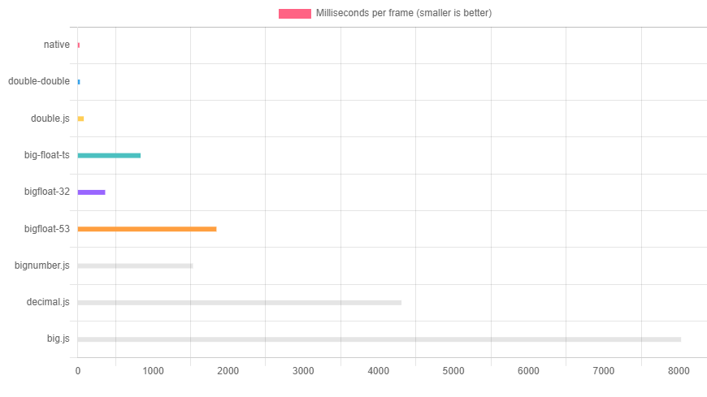

# Pure double & double-double floating point arithmetic functions *with strict error bounds*

>This library is only possible through the research of [Mioara Joldes, Jean-Michel Muller, Valentina 
>Popescu, *Tight and rigourous error bounds for basic building blocks of double-word arithmetic*](https://hal.>archives-ouvertes.fr/hal-01351529v3/document)

## [Documentation](https://florissteenkamp.github.io/double-double/)

## Overview
* **[Double-double precision](https://en.wikipedia.org/wiki/Quadruple-precision_floating-point_format#Double-double_arithmetic)** floating point operators (similar to quad precision)
* Each function documents a strict error bound (see research [1] below)
* Optimized for speed (see benchmark below)
* Operators include: +, -, *, /, √, abs, <, >, ===, min, max, etc.
* Operators mixing double and double-doubles are also included, e.g. `ddAddDouble` (for adding a double to a double-double)
* Error free double precision operators also included, e.g. `twoProduct` (for calculating the *exact* result of multiplying two doubles)
* No classes ⇒ a double-double is simply a length 2 `Number` array, e.g.
```typescript
import { twoSum } from 'double-double';
// Specified directly (low order double first)
const a = [-4.357806199228875e-10, 11_638_607.274152497];
// ...or more usually from an earlier calculation
const b = twoSum(213.456, 111.111);  // => [-1.4210854715202004e-14, 324.567] (completely error-free)
```
* All functions are pure, e.g. 
```typescript
// using `a` and `b` as defined above (ddAddDd => double-double + double-double)
const c = ddAddDd(a,b);  // => [-2.42072459299969e-10, 11638931.841152497]
```
* No dependencies


## Installation

```cli
npm install double-double
```

This package is [ESM only](https://gist.github.com/sindresorhus/a39789f98801d908bbc7ff3ecc99d99c)
and can be used in `Node.js` (or in a browser when bundled using e.g. Webpack).

Additionally, self-contained `ECMAScript Module` (ESM) files `index.module.js` and
`index.module.min.js` in the `./browser` folder is provided.

Or, if you need a legacy browser script there is also `index.js`
and `index.min.js` in the `./browser` folder. Either script exposes a global 
variable called `doubleDouble`.

See full examples below.

## A Practical example (Node.js)
Let's say you want to calculate the determinant of the following 2x2 matrix:\
 ┌─   ─┐\
 │ A B │\
 │ C D │\
 └─   ─┘

In other words, let's say you want to calculate `(A*D - B*C)`.

Let's further assume:
```javascript
const A = 11.13;               // A is double precision ieee754 floating point number
const B = 8.664;               // ...
const C = 3.6329224376731304;  // ...
const D = 2.828;               // ...
```

In double precision the calculation is easy:
```javascript
const d = A*D - B*C  // => 0
```

but gives the completely wrong answer of `0` due to round-off combined with
catastrophic cancellation.

Using double-double precision gives:
```javascript
import { twoProduct, ddDiffDd } from 'double-double';

// dd = A*D - B*C
const dd = ddDiffDd(twoProduct(A,D), twoProduct(B,C)); // => [0, -9.743145041148111e-17]

// The final answer can easily be rounded to the 'nearest' double:
const d1 = dd[0] + dd[1];  // => -9.743145041148111e-17
// or, alternatively truncated
const d2 = dd[1];  // => -9.743145041148111e-17
```

So the final result (after rounding back to double precision) is `-9.743145041148111e-17`
which is the *exact* result (i.e. no error) in this case.

As another example, if we take:
```javascript
const A = 0.13331;
const B = 8.668;
const C = 3.609;
const D = 2.885;
```

we get the result (again after rounding to double precision) to be:
```javascript
const d2 = -30.898212649999998;
```

Let us calculate an absolute error bound of the above? (This may or may not be
important depending on the application.)

The documentation of `ddDiffDd` states:
* Relative error bound: `3u^2 + 13u^3`, i.e. `fl(a-b) = (a-b)(1+ϵ)`, where `ϵ <= 3u^2 + 13u^3`, `u = 0.5 * Number.EPSILON`

For simplicity we incorporate the 3rd order term of `13u^3` in 
the 2nd order term, i.e. `3u^2` becomes `4u^2` === `4.930380657631324e-32` < `5e-32`. 
(Note that the `fl()` function above is not the usual one in double precision, but
instead represents a double-double precision calculation. Also, `fl(a - b)` is
often denoted by `a ⊖ b` as for example in [What Every Computer Scientist Should Know About Floating-Point Arithmetic](https://docs.oracle.com/cd/E19957-01/806-3568/ncg_goldberg.html).)

The maximum absolute error bound is then `|a - b||ϵ| = |0.13331*2.885 - 8.668*3.609||5e-32| = 1.5449106325000001e-30`
where `A, B, C` and `D` is as given previously. (The actual error is `4.930380657631324e-32`)

In other words the calculation of `dd` above as a double-double represented as
the length 2 array `[6.3219416368554e-16, -30.898212649999998]` with exact value
`6.3219416368554e-16 + -30.898212649999998` is accurate up to roughly the 30th
digit. (Typically the calculations will be more complex such as when the matrix is, say, `3x3`
and the final result is often truncated to double precision.)

## Usage

### Node.js
```JavaScript
// @filename: `test.mjs` (or `test.js` if { "type": "module" } is specified in your package.json)
import { ddAddDd } from 'double-double';  // `ddAddDd` returns the sum of two double-doubles 

const dd1 = [-4.357806199228875e-10, 11638607.274152497];  // some double-double
const dd2 = [4.511949494578893e-11, -2797357.2918064594];  // another double-double

const r1 = ddAddDd(dd1,dd2);  // sum the two double-doubles
const r2 = [-3.906611249770986e-10, 8841249.982346037];  // the correct result

if (r1[0] === r2[0] && r1[1] === r2[1]) {
    console.log('success! 😁');  // we should get to here!
} else {
    console.log('failure! 😥');  // ...and not here
}
```

### Browsers - directly, without a bundler, using the pre-bundled minified .js file

Please note that no tree shaking will take place in this case.

```html
<!doctype html>

<html lang="en">
<head>
    <script type="module">
        import { ddAddDd } from "./node_modules/double-double/browser/index.min.js";

        const dd1 = [-4.357806199228875e-10, 11638607.274152497];  // some double-double
        const dd2 = [4.511949494578893e-11, -2797357.2918064594];  // another double-double

        const r1 = ddAddDd(dd1,dd2);  // sum the two double-doubles
        const r2 = [-3.906611249770986e-10, 8841249.982346037];  // the correct result

        if (r1[0] === r2[0] && r1[1] === r2[1]) {
            console.log('success! 😁');  // we should get to here!
        } else {
            console.log('failure! 😥');  // ...and not here
        }
    </script>
</head>

<body>Check the console.</body>

</html>
```

### Bundlers (Webpack, Rollup, ...)

Tree shaking will take place if supported by your bundler.

Webpack will be taken as an example here.

Since your webpack config file might still use `CommonJS` you must rename 
`webpack.config.js` to `webpack.config.cjs`.

If you are using TypeScript:

Since this is an [ESM only](https://gist.github.com/sindresorhus/a39789f98801d908bbc7ff3ecc99d99c)
library you must use [resolve-typescript-plugin](https://www.npmjs.com/package/resolve-typescript-plugin) 
(at least until webpack catches up with ESM?) in your `webpack.config.cjs` file.

```cli
npm install --save-dev resolve-typescript-plugin
```

and follow the instructions given at [resolve-typescript-plugin](https://www.npmjs.com/package/resolve-typescript-plugin).

Additionally, follow this [guide](https://gist.github.com/sindresorhus/a39789f98801d908bbc7ff3ecc99d99c#how-can-i-make-my-typescript-project-output-esm).


>**❗Important❗**
>
>When using bundlers:
>
>```TypeScript
>import { operators } from 'double-double'
>```
>
> and then later in the code get the functions you need, e.g.:
>
>```TypeScript
>const { ddAddDd as add, twoProduct, /* etc. */ } = operators;
>```
>
>as opposed to importing the operators directly.
>
>This will increase performance roughly 5 times!
>
>**Why?** Because Webpack (and Rollup) exports functions using getters that gets 
>invoked on every function call adding a big overhead and slowing down each
>function. This is not an issue if the code is not bundled, e.g. when
>using Node.js.


## Research
The following research / books / lectures have been used or are directly relevant to this library (especially the first two):
1. [Mioara Joldes, Jean-Michel Muller, Valentina Popescu, *Tight and rigourous error bounds for basic building
blocks of double-word arithmetic*](https://hal.archives-ouvertes.fr/hal-01351529v3/document)
2. [T. J. Dekker, *A Floating-Point Technique for Extending the Available Precision*](http://csclub.uwaterloo.ca/~pbarfuss/dekker1971.pdf)
3. [Yozo Hida, Xiaoye S. Li, David H. Bailey, *Library for Double-Double and Quad-Double Arithmetic*](https://www.researchgate.net/publication/228570156_Library_for_Double-Double_and_Quad-Double_Arithmetic)
4. [Nicholas J. Higham, *Accuracy and Stability of Numerical Algorithms*](http://ftp.demec.ufpr.br/CFD/bibliografia/Higham_2002_Accuracy%20and%20Stability%20of%20Numerical%20Algorithms.pdf)

## [Benchmark](https://florissteenkamp.github.io/big-float-benchmark/)



## Similar libraries in Javascript / TypeScript
* [double.js](https://github.com/munrocket/double.js)

## License
MIT